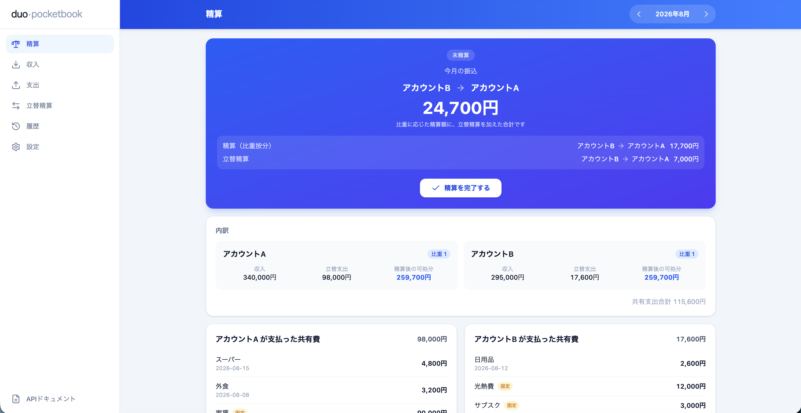

# duo-pocketbook

🚀 **ライブデモ**: <https://tacky0612.github.io/duo-pocketbook/>（ログイン画面の「デモモードで試す（API不要）」から、サーバー不要でブラウザ内の擬似データで全機能を体験できます）

📖 **APIドキュメント**: <https://tacky0612.github.io/duo-pocketbook/api-docs.html>（ReDoc）

## duo-pocketbook とは

**duo-pocketbook** は、パートナーやルームメイトなど **2人で共有する支出を管理し、月末の精算額を自動で算出する家計簿 Web アプリケーション**です。「今月は誰がいくら払った」「結局いくら渡せばフェアなのか」という手計算の手間をなくします。

2人でお金を出し合って暮らしていると、支出のメモはたまっても「収入差をどう反映して精算するか」で悩みがちです。duo-pocketbook は、共有支出と双方の収入を登録するだけで、**指定した比重に応じて双方の可処分所得が揃うように振込額を計算**します。

## 主な機能

- **📥 収入の登録** — 月ごとに2アカウントそれぞれの収入を入力
- **📤 共有支出の登録** — どちらが立て替えたかを記録。固定費（家賃・光熱費・サブスクなど）の継続登録にも対応
- **⚖️ 精算額の自動計算** — 比重（例 1:1、収入比など）に応じて、可処分所得が等しくなる振込額を算出。「誰から誰へいくら」を一目で表示
- **🔁 立替精算** — 比重按分とは別に、個別の立替分をそのまま相手に返す精算も合算
- **✅ 月次の精算確定** — 精算を完了すると、その月のデータは編集ロックされ記録として残る
- **🕘 履歴の確認** — 過去の月の収支・精算結果をいつでも振り返り
- **🔐 2アカウント専用のログイン** — 想定する2ユーザーのみがアクセスできる認証付き

## 無料枠だけで動く

duo-pocketbook は **AWS・Cloudflare などのクラウドサービスをすべて無料枠の範囲内で運用**できるように設計しています。個人が2人で使う規模であれば、追加コストをかけずに継続利用できます。

- **AWS Lambda + Function URL** — API を常時無料枠内で実行
- **Amazon DynamoDB** — PROVISIONED 1RCU/1WCU（常時無料枠内）でデータを保存
- **Cloudflare / GitHub Pages** — フロントエンドと API ドキュメントを無料で配信

無料枠を前提とした構成の詳細は [docs/infrastructure.md](docs/infrastructure.md) / [docs/deployment.md](docs/deployment.md) を参照してください。

## ドキュメント

アーキテクチャ・API・データモデル・開発／デプロイ手順などの技術情報は、まとめて以下にあります。

📚 **[docs/](docs/README.md)** — アーキテクチャ / インフラ / 精算仕様 / API / データモデル / 開発 / デプロイ

## コントリビュート

バグ報告・機能提案・Pull Request を歓迎します。開発フローやコーディング規約は [CONTRIBUTING.md](CONTRIBUTING.md) を、参加時の心得は [行動規範（CODE_OF_CONDUCT.md）](CODE_OF_CONDUCT.md) を参照してください。

脆弱性を見つけた場合は、公開 Issue ではなく [SECURITY.md](SECURITY.md) の手順に従って報告してください。

## ライセンス

[MIT License](LICENSE) の下で公開しています。
