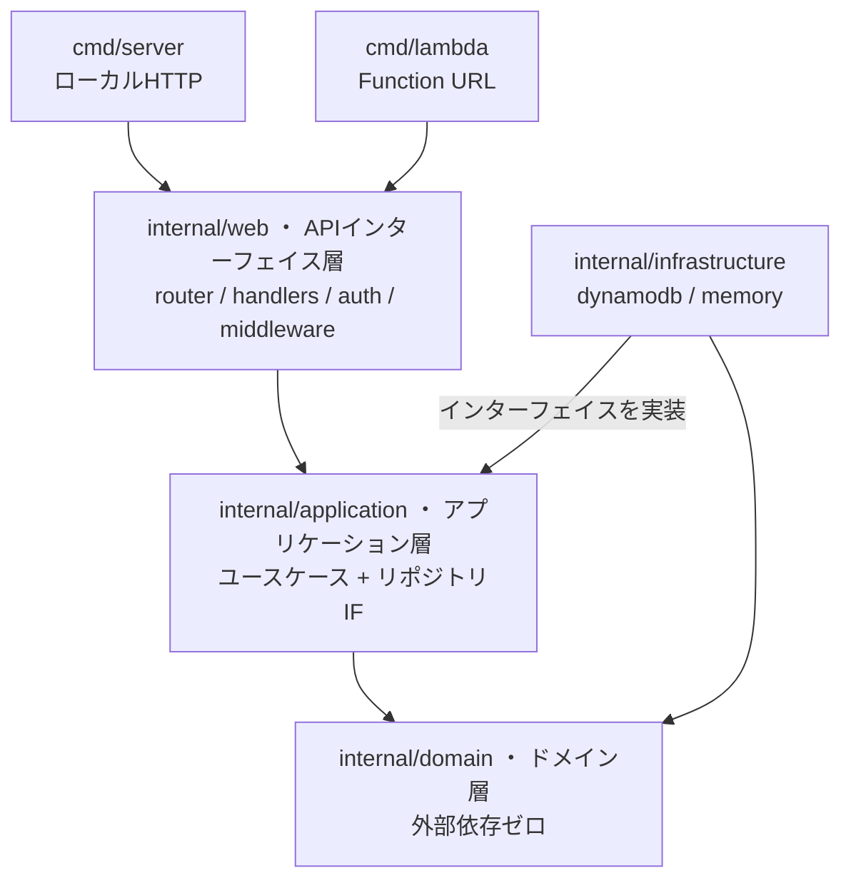

# アーキテクチャ

クリーンアーキテクチャとドメイン駆動設計（DDD）を採用している。**依存の向きは常に内側（ドメイン層）へ** 向かい、ドメイン層は外部の何にも依存しない。

矢印は「依存の向き」を表す。すべての依存は内側の `internal/domain` へ向かう。

## 各レイヤーの責務

### ドメイン層 — `internal/domain/`

業務上の重要判断を**外部依存なし**（Go標準ライブラリのみ）で定義する。

| ファイル | 内容 |
|---|---|
| `money.go` | `Money`（整数円の値オブジェクト） |
| `yearmonth.go` | `YearMonth`（対象年月。`2026-07` 形式のパース/整形） |
| `member.go` | `Member` / `Couple`（常にちょうど2人という制約を型で表現） |
| `weight.go` | `Weight`（精算比重。正整数のみ） |
| `expense.go` | `Expense`（共有支出）。IDは `<yyyy-MM>_<hex>` 形式で対象月を内包 |
| `income.go` | `MonthlyIncome`（月次収入） |
| `recurring_expense.go` | `RecurringExpense`（固定費）。`AsExpenseFor` で対象月の共有支出として実体化する |
| `settlement.go` | **コアの精算計算** `CalculateSettlement`（→ [settlement.md](settlement.md)） |
| `errors.go` | `ErrValidation` / `ErrIncomeNotReady` |

### アプリケーション層 — `internal/application/`

ユースケース（アプリケーションとしての動作）を定義する。永続化は `repository.go` の**インターフェイス**（`ExpenseRepository` / `IncomeRepository` / `RecurringExpenseRepository` / `SettlementStatusRepository` / `SettingsRepository` / `AccountRepository`）経由でのみアクセスし、実装には依存しない。

- `ExpenseUsecase` — 支出の登録・更新・月別一覧（日付降順）・削除
- `SettlementUsecase` — 収入の入力/取得、精算結果の計算、精算済みフラグの取得/更新、精算履歴の取得（固定費を対象月の支出として合算する）
- `RecurringExpenseUsecase` — 固定費の登録・更新・一覧・削除
- `SettingsUsecase` — 精算比重の取得/更新（未設定時はデフォルト1:1）、メンバー表示名/カラーの取得・上書き
- `AccountUsecase` — 起動時のアカウントプロビジョニング（不変の AccountID 生成）、ログイン認証（bcrypt照合）、ログインID/パスワードの変更（→ [data-model.md](data-model.md) の「AccountID とログインIDの分離」）

### インフラ層 — `internal/infrastructure/`

リポジトリインターフェイスの実装。外部依存とのやり取りをここに閉じ込める。

- `dynamodb/` — 本番・統合テスト用。AWS SDK v2 を使用（→ [data-model.md](data-model.md)）。`DYNAMO_ENDPOINT` 指定時は DynamoDB Local に接続し、テーブルを自動作成する
- `memory/` — ユニットテスト・軽量ローカル起動用のインメモリ実装

### Web層 — `internal/web/`

APIインターフェイス。リクエスト/レスポンスの変換のみを担い、業務ロジックは持たない。

- `router.go` — Go 1.22+ の `http.ServeMux` パターンルーティング（外部ルーター不使用）
- `handlers.go` — DTO変換とエラー→HTTPステータスのマッピング
- `auth.go` — JWT発行/検証（HS256）+ 認証ミドルウェア
- `middleware.go` — CORS
- `bootstrap.go` — 設定からリポジトリ実装を選択して全体を組み立てる（`TABLE_NAME` があれば DynamoDB、なければインメモリ）

`api/openapi.yaml` がこの層の契約。ただし**手書きせず Go コードから生成**する: 各ハンドラの [swag](https://github.com/swaggo/swag) 注釈（`// @Summary` / `// @Router` 等）と DTO 型が正で、`make openapi` で `api/openapi.yaml`（OpenAPI 3.1）を出力する。エンドポイントを変更したら注釈・DTO を直して再生成する（CI の `openapi-check` が同期を検証）。詳細は [api.md](api.md) と [development.md](development.md) を参照。

## エントリポイント

`cmd/server`（ローカルHTTPサーバー + `frontend/dist` 静的配信）と `cmd/lambda`（Lambda Function URL、ペイロード v2）は、**同一のルーター** `web.BuildHandler` を共有する。環境差はエントリポイントだけに閉じている。

## フロントエンド — `frontend/`

TypeScript（strict）+ React + Vite + Tailwind CSS。UIはコンポーネント（`src/components/`）で組み立てており、API呼び出しは `src/lib/apiClient.ts`、セッション管理は `src/lib/session.ts` に集約している。`App.tsx` がデータ取得と状態を保持し、各コンポーネントへ渡す。ドメイン／API の共有型は `src/types.ts` に定義し、`api<T>()` の戻り値型として利用する。
