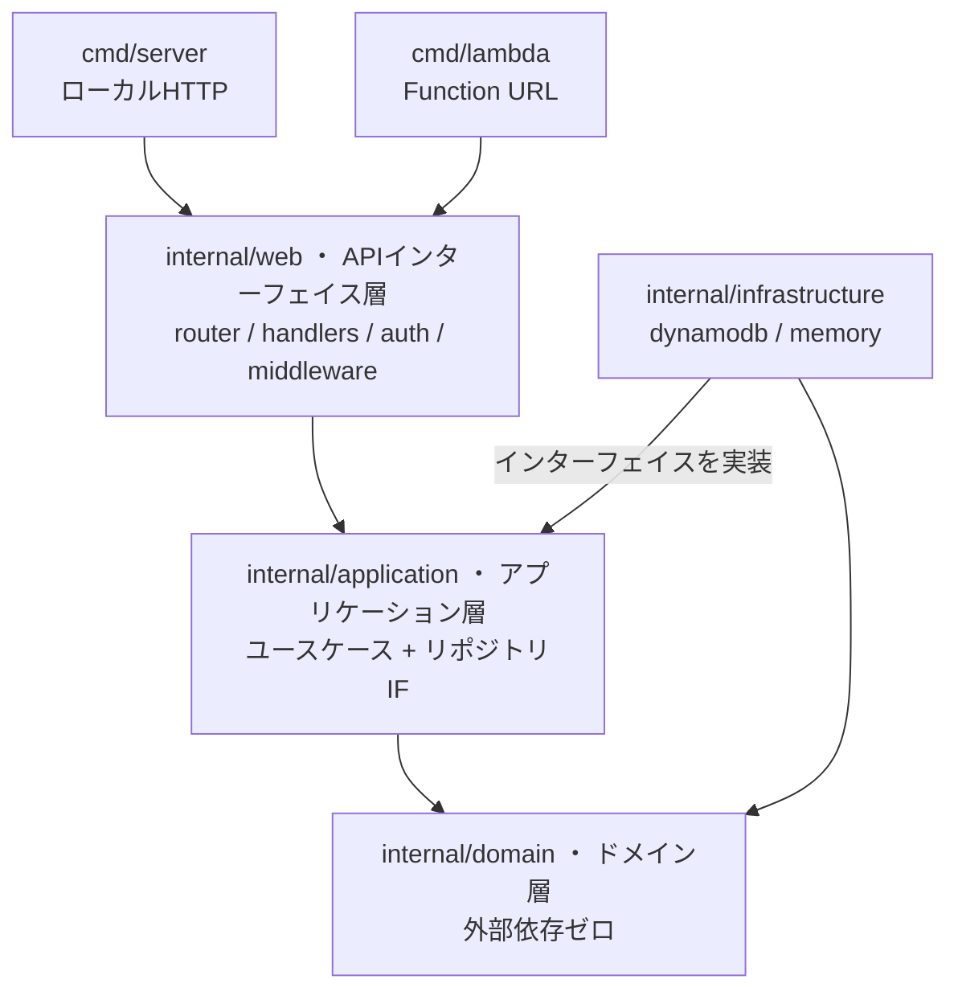

# アーキテクチャ

クリーンアーキテクチャとドメイン駆動設計（DDD）を採用している。**依存の向きは常に内側（ドメイン層）へ** 向かい、ドメイン層は外部の何にも依存しない。

矢印は「依存の向き」を表す。すべての依存は内側の `internal/domain` へ向かう。

```mermaid
flowchart TD
    server["cmd/server<br/>ローカルHTTP"]
    lambda["cmd/lambda<br/>Function URL"]
    web["internal/web ・ APIインターフェイス層<br/>router / handlers / auth / middleware"]
    app["internal/application ・ アプリケーション層<br/>ユースケース + リポジトリIF"]
    domain["internal/domain ・ ドメイン層<br/>外部依存ゼロ"]
    infra["internal/infrastructure<br/>dynamodb / memory"]

    server --> web
    lambda --> web
    web --> app
    app --> domain
    infra -->|"インターフェイスを実装"| app
    infra --> domain
```

## 各レイヤーの責務

### ドメイン層 — `internal/domain/`

業務上の重要判断を**外部依存なし**（Go標準ライブラリのみ）で定義する。

| ファイル | 内容 |
|---|---|
| `money.go` | `Money`（整数円の値オブジェクト） |
| `yearmonth.go` | `YearMonth`（対象年月。`2026-07` 形式のパース/整形） |
| `member.go` | `Member` / `Couple`（常にちょうど2人という制約を型で表現） |
| `weight.go` | `Weight`（精算比重。正整数のみ） |
| `expense.go` | `Expense`（共有支出）。IDは `<yyyy-MM>_<hex>` 形式で対象月を内包 |
| `salary.go` | `Salary`（月次給与。メンバーごと・月ごとに1件。精算の可否判定に使う）、未入力分を前月の給与で補う概算用の `EstimateSalaries` |
| `income.go` | `Income`（給与とは別の追加収入。内容付き・日付なし・継続/単発）。IDは継続 `inc_<hex>` / 単発 `<yyyy-MM>_<hex>` |
| `recurring_expense.go` | `RecurringExpense`（固定費）。`AsExpenseFor` で対象月の共有支出として実体化する |
| `reservation.go` | `Reservation`（金額未確定の収入・支出の予約。毎月/単発。IDは頻度に依存しない `rsv_<hex>` で、「今月はなし」の月 `SkippedMonths` も持つ）、実データの登録元を表す値オブジェクト `ReservationRef`（ゼロ値＝予約に由来しない）、予約から支出／収入を生成する `FulfillAsExpense` / `FulfillAsIncome`、精算月ごとの入力状況を判定する `ResolveReservations`（入力済み/今月はなし/未入力） |
| `direct_transfer.go` | `DirectTransfer`（立替精算）。共有支出とは別に A→B へ渡す金額。継続（毎月）と単発（特定月）がある |
| `settlement.go` | **コアの精算計算** `CalculateSettlement`（固定費・立替精算を含む。→ [settlement.md](settlement.md)） |
| `errors.go` | `ErrValidation` / `ErrIncomeNotReady` |

### アプリケーション層 — `internal/application/`

ユースケース（アプリケーションとしての動作）を定義する。永続化は `repository.go` の**インターフェイス**（`ExpenseRepository` / `SalaryRepository` / `IncomeRepository` / `RecurringExpenseRepository` / `DirectTransferRepository` / `ReservationRepository` / `SettlementSnapshotRepository` / `SettingsRepository` / `AccountRepository`）経由でのみアクセスし、実装には依存しない。

- `ExpenseUsecase` — 支出の登録・更新・月別一覧（日付降順）・削除
- `SettlementUsecase` — 給与の入力/取得、精算結果の計算、前月の給与実績で補った概算（`EstimateSettlement`）、精算の完了/取り消し（完了時点の精算内容をスナップショットとして保存/削除）、精算履歴（スナップショット）の取得（給与＋追加収入を各メンバーの収入として合算し、固定費を対象月の支出として合算し、立替精算を振込額へ加算する）
- `IncomeUsecase` — 追加収入の登録・更新・月別一覧・削除（継続/単発）
- `ReservationUsecase` — 予約の登録・更新・月別一覧（入力状況つき）・削除、金額入力（予約IDを紐づけた共有支出／単発の追加収入として登録）、「今月はなし」のスキップ/解除、同じ予約・月への二重入力を防ぐ入力ロック
- `RecurringExpenseUsecase` — 固定費の登録・更新・一覧・削除
- `DirectTransferUsecase` — 立替精算の登録・更新・月別一覧・削除（継続/単発）
- `SettingsUsecase` — 精算比重の取得/更新（未設定時はデフォルト1:1）、メンバー表示名/カラーの取得・上書き
- `AccountUsecase` — 起動時のアカウントプロビジョニング（不変の AccountID 生成）、ログイン認証（bcrypt照合）、ログインID/パスワードの変更（→ [data-model.md](data-model.md) の「AccountID とログインIDの分離」）

### インフラ層 — `internal/infrastructure/`

リポジトリインターフェイスの実装。外部依存とのやり取りをここに閉じ込める。

- `dynamodb/` — 本番・統合テスト用。AWS SDK v2 を使用（→ [data-model.md](data-model.md)）。`DYNAMO_ENDPOINT` 指定時は DynamoDB Local に接続し、テーブルを自動作成する。キー定義とパーティション全件取得の共通処理（`queryByPK`）は `repository.go` に集約し、各エンティティの実装は同名のファイルに置く
- `memory/` — ユニットテスト・軽量ローカル起動用のインメモリ実装

### Web層 — `internal/web/`

APIインターフェイス。リクエスト/レスポンスの変換のみを担い、業務ロジックは持たない。

- `router.go` — Go 1.22+ の `http.ServeMux` パターンルーティング（外部ルーター不使用）
- `handler.go` — `Handler`（ハンドラ群が使うユースケースの束）の定義と生成
- `handler_<resource>.go` — リソースごとのハンドラ。そのリソースの DTO・リクエスト/レスポンス型・swag 注釈を同じファイルにまとめる（`handler_expense.go` / `handler_income.go` / `handler_reservation.go` / `handler_settlement.go` / `handler_settings.go` など）。テストも `handler_<resource>_test.go` に対応させ、共通ヘルパーは `helpers_test.go` に置く
- `response.go` — 共通のレスポンス書き出し・エラー→HTTPステータスのマッピング・リクエストボディの読み取り
- `auth.go` — JWT発行/検証（HS256）+ 認証ミドルウェア
- `middleware.go` — CORS
- `bootstrap.go` — 設定からリポジトリ実装を選択して全体を組み立てる（`TABLE_NAME` があれば DynamoDB、なければインメモリ）

`api/openapi.yaml` がこの層の契約。ただし**手書きせず Go コードから生成**する: 各ハンドラの [swag](https://github.com/swaggo/swag) 注釈（`// @Summary` / `// @Router` 等）と DTO 型が正で、`make openapi` で `api/openapi.yaml`（OpenAPI 3.1）を出力する。エンドポイントを変更したら注釈・DTO を直して再生成する（CI の `openapi-check` が同期を検証）。詳細は [api.md](api.md) と [development.md](development.md) を参照。

## エントリポイント

`cmd/server`（ローカルHTTPサーバー + `frontend/dist` 静的配信）と `cmd/lambda`（Lambda Function URL、ペイロード v2）は、**同一のルーター** `web.BuildHandler` を共有する。環境差はエントリポイントだけに閉じている。

## フロントエンド — `frontend/`

TypeScript（strict）+ React + Vite + Tailwind CSS。UIはコンポーネント（`src/components/`）で組み立てており、API呼び出しは `src/lib/apiClient.ts`、セッション管理は `src/lib/session.ts` に集約している。`App.tsx` がデータ取得と状態を保持し、各コンポーネントへ渡す。ドメイン／API の共有型は `src/types.ts` に定義し、`api<T>()` の戻り値型として利用する。

グラフ描画には [Recharts](https://recharts.org/) を使う。

- 精算画面の内訳: 収入と支出（支払った共有費）をメンバーごとの比率で示す比率バー（`src/components/SettlementRatioChart.tsx`）
- 履歴画面: 精算済みの月ごとに各メンバーが支払った共有費を積み上げた積層面グラフ（`src/components/ExpenseHistoryChart.tsx`）。精算済みの月が2か月以上あるときに表示する

メンバーの系列は `/members` のアカウントカラーで塗り（共通処理は `src/lib/chart.ts`、凡例は `src/components/ChartLegend.tsx`）、初期表示時にアニメーションさせる（OS の「視差効果を減らす」設定では無効）。ライブラリが大きいため `React.lazy` で別チャンクに分けて遅延読み込みしている。

描画中のエラーで画面全体が真っ白にならないよう、エラーバウンダリ（`src/components/ErrorBoundary.tsx`）を2段で置いている。

- アプリ全体（`src/main.tsx`）: エラー内容（エラー名・メッセージ・User-Agent）と「再読み込み」ボタンを表示する（`src/components/AppErrorFallback.tsx`）
- グラフ（`src/components/ChartBoundary.tsx`）: 遅延読み込みの失敗（デプロイ後に古いチャンクを取りにいった場合など）や描画エラーをグラフ部分だけで受け止め、画面の他の部分は使えるようにする

イベントハンドラや非同期処理のエラーはエラーバウンダリの対象外で、従来どおり各画面の `onError`（トースト表示など）で扱う。
