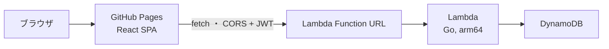
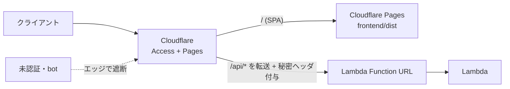

# デプロイガイド

## 全体構成



**すべてAWSの常時無料枠内で運用する**ことが本プロジェクトの制約。

| リソース | 無料枠 | 本構成での使い方 |
|---|---|---|
| Lambda | 100万リクエスト/月 + 40万GB秒/月（**永続無料**） | 128MB / arm64 / timeout 10s |
| Lambda Function URL | 追加料金なし | APIエンドポイント。API Gatewayは12ヶ月無料のみのため**不使用** |
| DynamoDB | 25 RCU / 25 WCU / 25GB（**永続無料**） | PROVISIONED 1/1。オンデマンドは無料枠対象外のため**不使用** |
| CloudWatch Logs | 5GB取り込み | 保持7日（`log_retention_days`） |
| GitHub Pages | 無料 | フロントエンド配信 |

## API のデプロイ（Terraform）

### 1. 認証情報の準備

```bash
# パスワードのbcryptハッシュを生成
go run ./cmd/hashpw 'taro-no-password'
go run ./cmd/hashpw 'hanako-no-password'

# JWTシークレットを生成
openssl rand -base64 48
```

```bash
cp terraform/terraform.tfvars.example terraform/terraform.tfvars
# terraform.tfvars を編集（コミット禁止: .gitignore 済み）
```

### 2. ビルドとデプロイ

```bash
make build-lambda                  # build/lambda.zip を生成
terraform -chdir=terraform init
terraform -chdir=terraform plan    # 変更内容の確認
terraform -chdir=terraform apply
```

出力される `function_url` がAPIのエンドポイント。

```bash
curl "$(terraform -chdir=terraform output -raw function_url)health"
# => {"status":"ok"}
```

### アプリ更新時

```bash
make build-lambda && terraform -chdir=terraform apply
```

`source_code_hash` によりzipが変わったときだけLambdaが更新される。

## フロントエンドのデプロイ（GitHub Pages）

1. リポジトリの **Settings → Pages → Source** を「GitHub Actions」に設定する
2. `main` ブランチへ `frontend/` の変更をpushすると `deploy-pages.yml` が自動でビルド・デプロイする（手動実行も可: workflow_dispatch）
3. 公開URL（`https://<user>.github.io/<repo>/`）を `terraform.tfvars` の `allowed_origins` に設定して `terraform apply`（CORS許可）
4. 公開ページのログイン画面「APIのURL」に Function URL を入力する

### デモモードの同梱

配信物には**デモモード**が同梱される（別ビルド・別デプロイは不要）。Lambda/API を用意していない人は、公開ページのログイン画面「デモモードで試す（API不要）」からブラウザ内のモックデータで全機能を体験できる。デモの編集内容は各自の端末の localStorage にのみ保存され、サーバーへは一切送信されない。仕組みの詳細は [開発ガイド](./development.md) の「デモモード」を参照。

## アクセス制限とコスト最適化

Function URL は `authorization_type = NONE`（公開）で、認証はアプリ側のJWTで行う。ただし不正リクエストでも Lambda は起動するため、公開エンドポイントが bot/DoS に叩かれると無料枠（呼び出し・GB秒・ログ取り込み）を超えるリスクがある。2人利用が前提のため、以下で「クライアント以外のトラフィックによるコスト」を抑える。

| 対策 | 設定 | 効果 |
|---|---|---|
| 予約同時実行数の上限 | `reserved_concurrency`（既定2） | 想定外の大量アクセスでも同時実行数を頭打ちにし、実行時間コストが青天井にならない。超過分は429スロットル |
| CORS を実オリジンに限定 | `allowed_origins`（GitHub PagesのURL） | 正規経路を明確化（※ブラウザ用の仕組みで攻撃防御そのものではない） |
| 事前共有クライアントキー | `client_key`（Lambda）＋ `VITE_CLIENT_KEY`（フロント） | `X-Client-Key` 不一致を403で早期遮断し、無差別botのDBアクセス・処理を削減。公開SPAに埋め込むため秘密ではなく多層防御の一枚 |
| ログイン試行のレート制限 | 実装済み（IP単位・既定5分に10回） | 総当り対策。超過時429 |
| timeout短縮 / 128MB / arm64 | `timeout = 5` 等 | 1回あたりのGB秒を最小化 |
| コスト監視 | `budget_alert_email` | 月$1超過でメール通知（AWS Budgets） |

`client_key` を使う場合の手順:

```bash
# 1. キーを生成し、terraform.tfvars の client_key に設定して apply
openssl rand -hex 24
# 2. 同じ値を GitHub リポジトリの Secrets に CLIENT_KEY として登録
#    → deploy-pages.yml が VITE_CLIENT_KEY としてビルドに注入する
```

## 実行元を絞る（Cloudflare Access／任意・強化構成）

「クライアント以外のリクエストで Lambda を起動させない（＝攻撃コストも防ぐ）」ために、Cloudflare（無料）を前段に置き、フロントと API を**同一ドメイン**にまとめて **Cloudflare Access** で保護する構成。未認証はエッジで遮断され Lambda は起動しない。GitHub Pages 配信からの移行が前提。



### 仕組み
- **同一ドメイン**（例 `app.example.com`）で SPA(`/`) と API(`/api/*`) を配信。同一オリジンなので Access の Cookie が効き、SPA からの `fetch` も認証が通る（別ドメインだとクロスオリジンで Cookie が乗らず Access が使えない）。
- **未認証遮断**: ドメイン全体を Access のポリシーでクライアント2人のメールのみ許可。未認証は Cloudflare エッジで弾かれ、オリジン（Function URL）に到達しない。
- **直叩き封じ**: 生の Function URL を直接叩く迂回を防ぐため、Cloudflare が**サーバ側で秘密ヘッダ `X-Client-Key` を注入**し、Lambda 側の `CLIENT_KEY` 検証で不一致を 403 にする（既存のクライアントキー機構を流用）。**秘密はブラウザに置かず Cloudflare が付与**するため、`VITE_CLIENT_KEY` は設定しない。

### セットアップ手順（Cloudflare ダッシュボード）
1. ドメインを Cloudflare に追加（無料プラン）。
2. **Cloudflare Pages** でフロントをデプロイ: リポジトリを連携し、ルートディレクトリ `frontend`、ビルドコマンド `npm run build`、出力 `dist`、ビルド環境変数 `VITE_API_BASE=/api` を設定。`app.example.com` を割り当てる。
3. **DNS / ルーティング**: 同ドメインの `/api/*` を Lambda Function URL へ転送する（Pages の Function/Redirect か、Cloudflare のオリジンルール/Worker で `/api` を除去して Function URL のホストへプロキシ）。
4. **Access アプリケーション**: `app.example.com` を対象に作成し、ポリシーでクライアント2人のメール（Google / One-time PIN 等）を allow。
5. **秘密ヘッダ注入**: Transform Rules（Modify Request Header）で、オリジンへ送るリクエストに `X-Client-Key: <ランダムな秘密>` を追加。
6. **Lambda 側**: `terraform.tfvars` の `client_key` に同じ秘密を設定して `apply`。`allowed_origins` は同一オリジン運用のため実質不要（設定しても害はない）。
7. フロントの `apiBase` はビルド時 `VITE_API_BASE=/api` により固定され、ログイン画面の「APIのURL」入力欄は非表示になる。

> 補足: より堅牢にするなら、秘密ヘッダの代わりに Cloudflare Access が付与する `Cf-Access-Jwt-Assertion` を Lambda で JWKS 検証する方式もある（実装追加が必要）。2人利用では秘密ヘッダ方式で十分。
>
> GitHub Pages を維持したまま実行元を絞りたい場合は、API のみ Cloudflare プロキシ＋無料 WAF/レート制限＋秘密ヘッダで代替できる（Access による SSO は使わず、認証はアプリの JWT のまま）。

## セキュリティ上の注意

- Function URL は `authorization_type = NONE` だが、`/health` と `/login` 以外は**アプリケーション側のJWT検証**で保護される
- パスワードは bcrypt ハッシュのみをLambda環境変数に保存する（平文の `MEMBERn_PASSWORD` はローカル専用）
- `terraform.tfvars` と tfstate には機微情報が含まれるためコミットしない（tfstateをリモート管理する場合はS3バックエンド等の暗号化を検討）
- IAMはテーブル単位の最小権限（GetItem/PutItem/DeleteItem/Query のみ）

## コスト監視

想定利用（クライアント2人・月数百リクエスト）では課金は発生しない。念のため AWS Budgets でゼロ支出アラート（例: $0.01 で通知）を設定しておくと安心。
