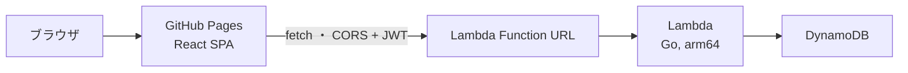

# デプロイガイド

## 全体構成



**すべてAWSの常時無料枠内で運用する**ことが本プロジェクトの制約。

| リソース | 無料枠 | 本構成での使い方 |
|---|---|---|
| Lambda | 100万リクエスト/月 + 40万GB秒/月（**永続無料**） | 128MB / arm64 / timeout 10s |
| Lambda Function URL | 追加料金なし | APIエンドポイント。API Gatewayは12ヶ月無料のみのため**不使用** |
| DynamoDB | 25 RCU / 25 WCU / 25GB（**永続無料**） | PROVISIONED 1/1。オンデマンドは無料枠対象外のため**不使用** |
| CloudWatch Logs | 5GB取り込み | 保持7日（`log_retention_days`） |
| GitHub Pages | 無料 | フロントエンド配信 |

## API のデプロイ（Terraform）

### 1. 認証情報の準備

```bash
# パスワードのbcryptハッシュを生成
go run ./cmd/hashpw 'taro-no-password'
go run ./cmd/hashpw 'hanako-no-password'

# JWTシークレットを生成
openssl rand -base64 48
```

```bash
cp terraform/terraform.tfvars.example terraform/terraform.tfvars
# terraform.tfvars を編集（コミット禁止: .gitignore 済み）
```

### 2. ビルドとデプロイ

```bash
make build-lambda                  # build/lambda.zip を生成
terraform -chdir=terraform init
terraform -chdir=terraform plan    # 変更内容の確認
terraform -chdir=terraform apply
```

出力される `function_url` がAPIのエンドポイント。

```bash
curl "$(terraform -chdir=terraform output -raw function_url)health"
# => {"status":"ok"}
```

### アプリ更新時

```bash
make build-lambda && terraform -chdir=terraform apply
```

`source_code_hash` によりzipが変わったときだけLambdaが更新される。

## フロントエンドのデプロイ（GitHub Pages）

1. リポジトリの **Settings → Pages → Source** を「GitHub Actions」に設定する
2. `main` ブランチへ `frontend/` の変更をpushすると `deploy-pages.yml` が自動でビルド・デプロイする（手動実行も可: workflow_dispatch）
3. 公開URL（`https://<user>.github.io/<repo>/`）を `terraform.tfvars` の `allowed_origins` に設定して `terraform apply`（CORS許可）
4. 公開ページのログイン画面「APIのURL」に Function URL を入力する

### デモモードの同梱

配信物には**デモモード**が同梱される（別ビルド・別デプロイは不要）。Lambda/API を用意していない人は、公開ページのログイン画面「デモモードで試す（API不要）」からブラウザ内のモックデータで全機能を体験できる。デモの編集内容は各自の端末の localStorage にのみ保存され、サーバーへは一切送信されない。仕組みの詳細は [開発ガイド](./development.md) の「デモモード」を参照。

## セキュリティ上の注意

- Function URL は `authorization_type = NONE` だが、`/health` と `/login` 以外は**アプリケーション側のJWT検証**で保護される
- パスワードは bcrypt ハッシュのみをLambda環境変数に保存する（平文の `MEMBERn_PASSWORD` はローカル専用）
- `terraform.tfvars` と tfstate には機微情報が含まれるためコミットしない（tfstateをリモート管理する場合はS3バックエンド等の暗号化を検討）
- IAMはテーブル単位の最小権限（GetItem/PutItem/DeleteItem/Query のみ）

## コスト監視

想定利用（夫婦2人・月数百リクエスト）では課金は発生しない。念のため AWS Budgets でゼロ支出アラート（例: $0.01 で通知）を設定しておくと安心。
