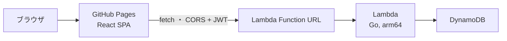
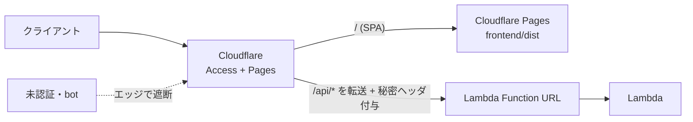

# デプロイガイド

## 全体構成



**すべてAWSの常時無料枠内で運用する**ことが本プロジェクトの制約。

| リソース | 無料枠 | 本構成での使い方 |
|---|---|---|
| Lambda | 100万リクエスト/月 + 40万GB秒/月（**永続無料**） | 128MB / arm64 / timeout 10s |
| Lambda Function URL | 追加料金なし | APIエンドポイント。API Gatewayは12ヶ月無料のみのため**不使用** |
| DynamoDB | 25 RCU / 25 WCU / 25GB（**永続無料**） | PROVISIONED 1/1。オンデマンドは無料枠対象外のため**不使用** |
| CloudWatch Logs | 5GB取り込み | 保持7日（`log_retention_days`） |
| GitHub Pages | 無料 | フロントエンド配信 |

## API のデプロイ（Terraform）

### 1. 認証情報の準備

```bash
# パスワードのbcryptハッシュを生成
go run ./cmd/hashpw 'taro-no-password'
go run ./cmd/hashpw 'hanako-no-password'

# JWTシークレットを生成
openssl rand -base64 48
```

```bash
cp terraform/terraform.tfvars.example terraform/terraform.tfvars
# terraform.tfvars を編集（コミット禁止: .gitignore 済み）
```

### 2. ビルドとデプロイ

```bash
make build-lambda                  # build/lambda.zip を生成
terraform -chdir=terraform init
terraform -chdir=terraform plan    # 変更内容の確認
terraform -chdir=terraform apply
```

出力される `function_url` がAPIのエンドポイント。

```bash
curl "$(terraform -chdir=terraform output -raw function_url)health"
# => {"status":"ok"}
```

### アプリ更新時

```bash
make build-lambda && terraform -chdir=terraform apply
```

`source_code_hash` によりzipが変わったときだけLambdaが更新される。

## CI/CD とシークレット管理（GitHub Actions で apply）

**通常はこちらを推奨**（上のローカル apply は代替）。apply を GitHub Actions で行い、シークレットはローカルの `terraform.tfvars` ではなく **GitHub 側で一元管理**する。

**構成**
- **AWS 認証**: GitHub OIDC → IAM ロール。長期アクセスキーを保存しない。
- **state**: S3 リモートバックエンド（暗号化・バージョニング・非公開、S3 ネイティブロック `use_lockfile`）。state には機密が平文で入るため必須。
- **トリガー**: PR で `terraform plan`（結果を PR にコメント）、apply は手動実行（`workflow_dispatch`）＋ `production` Environment 承認。
- ワークフロー: `.github/workflows/terraform.yml`

**シークレット / 変数の置き場所**

| 値 | 置き場所 |
|---|---|
| AWS 資格情報 | OIDC（保存しない）。ロールARN → Secrets `AWS_ROLE_ARN` |
| `CLOUDFLARE_API_TOKEN` | Secrets |
| `jwt_secret` / `account1_password_hash` / `account2_password_hash` / `client_key` | Secrets（`JWT_SECRET` 等）→ `TF_VAR_*` |
| `client_emails`（JSON配列文字列） / `budget_alert_email` / `cloudflare_account_id` / `cloudflare_zone_id` | Secrets → `TF_VAR_*` |
| `account*_login_id`（初期ログインID） | Secrets `ACCOUNT*_LOGINID` → `TF_VAR_*`（表示名はアプリ既定値のため設定しない） |
| `TF_STATE_BUCKET` | Variables |
| 非機密の設定（region, app_domain, github_owner/repo, enable_cloudflare 等） | リポジトリの `terraform/prod.auto.tfvars` |

**初回セットアップ**
1. ブートストラップ（state バケット＋GitHub OIDC＋CIロール）をローカルで一度だけ apply:
   ```bash
   terraform -chdir=terraform/bootstrap init
   terraform -chdir=terraform/bootstrap apply \
     -var 'state_bucket_name=duo-pocketbook-tfstate-xxxxxxxx' \
     -var 'github_owner=tacky0612' -var 'github_repo=duo-pocketbook'
   ```
   出力 `ci_role_arn` → Secrets `AWS_ROLE_ARN`、`state_bucket` → Variables `TF_STATE_BUCKET`。
2. GitHub の Secrets / Variables を上表に従い設定。生成例: `JWT_SECRET`=`openssl rand -base64 48`、`ACCOUNTn_PASSWORD_HASH`=`go run ./cmd/hashpw '<pw>'`、`CLIENT_KEY`=`openssl rand -hex 24`、`CLIENT_EMAILS`=`["you@example.com","partner@example.com"]`。
3. `production` Environment を作成し必須レビュアーを設定（apply の承認ゲート）。
4. PR を出すと plan がコメントされる。apply は Actions タブの `Terraform` ワークフローを手動実行（承認後に適用）。

> ローカル apply する場合は `terraform init -backend-config=backend.hcl`（`backend.hcl.example` 参照）の上、機密を `terraform.tfvars`（gitignore 済み）に置く。state は共有 S3 を使うため、ローカルと CI の二重適用に注意（原則 CI 経由に統一）。

## フロントエンドのデプロイ（GitHub Pages）

1. リポジトリの **Settings → Pages → Source** を「GitHub Actions」に設定する
2. `main` ブランチへ `frontend/` の変更をpushすると `deploy-pages.yml` が自動でビルド・デプロイする（手動実行も可: workflow_dispatch）
3. 公開URL（`https://<user>.github.io/<repo>/`）を `terraform.tfvars` の `allowed_origins` に設定して `terraform apply`（CORS許可）
4. 公開ページのログイン画面「APIのURL」に Function URL を入力する

### デモモードの同梱

配信物には**デモモード**が同梱される（別ビルド・別デプロイは不要）。Lambda/API を用意していない人は、公開ページのログイン画面「デモモードで試す（API不要）」からブラウザ内のモックデータで全機能を体験できる。デモの編集内容は各自の端末の localStorage にのみ保存され、サーバーへは一切送信されない。仕組みの詳細は [開発ガイド](./development.md) の「デモモード」を参照。

## アクセス制限とコスト最適化

Function URL は `authorization_type = NONE`（公開）で、認証はアプリ側のJWTで行う。ただし不正リクエストでも Lambda は起動するため、公開エンドポイントが bot/DoS に叩かれると無料枠（呼び出し・GB秒・ログ取り込み）を超えるリスクがある。2人利用が前提のため、以下で「クライアント以外のトラフィックによるコスト」を抑える。

| 対策 | 設定 | 効果 |
|---|---|---|
| 予約同時実行数の上限 | `reserved_concurrency`（既定 -1＝無効） | 正の値で同時実行を頭打ちにでき、実行時間コストが青天井にならない。※新規AWSアカウントは同時実行上限が10のため予約設定は不可（`-1`のまま）。上限を引き上げてから小さな正の値に。なお上限10自体が実質のキャップになる |
| CORS を実オリジンに限定 | `allowed_origins`（GitHub PagesのURL） | 正規経路を明確化（※ブラウザ用の仕組みで攻撃防御そのものではない） |
| 事前共有クライアントキー | `client_key`（Lambda）＋ `VITE_CLIENT_KEY`（フロント） | `X-Client-Key` 不一致を403で早期遮断し、無差別botのDBアクセス・処理を削減。公開SPAに埋め込むため秘密ではなく多層防御の一枚 |
| ログイン試行のレート制限 | 実装済み（IP単位・既定5分に10回） | 総当り対策。超過時429 |
| timeout短縮 / 128MB / arm64 | `timeout = 5` 等 | 1回あたりのGB秒を最小化 |
| コスト監視 | `budget_alert_email` | 月$1超過でメール通知（AWS Budgets） |

`client_key` を使う場合の手順:

```bash
# 1. キーを生成し、terraform.tfvars の client_key に設定して apply
openssl rand -hex 24
# 2. 同じ値を GitHub リポジトリの Secrets に CLIENT_KEY として登録
#    → deploy-pages.yml が VITE_CLIENT_KEY としてビルドに注入する
```

## 実行元を絞る（Cloudflare Access／任意・強化構成）

「クライアント以外のリクエストで Lambda を起動させない（＝攻撃コストも防ぐ）」ために、Cloudflare（無料）を前段に置き、フロントと API を**同一ドメイン**にまとめて **Cloudflare Access** で保護する構成。未認証はエッジで遮断され Lambda は起動しない。GitHub Pages 配信からの移行が前提。



### 仕組み
- **同一ドメイン**（例 `app.example.com`）で SPA(`/`) と API(`/api/*`) を配信。同一オリジンなので Access の Cookie が効き、SPA からの `fetch` も認証が通る（別ドメインだとクロスオリジンで Cookie が乗らず Access が使えない）。
- **未認証遮断**: ドメイン全体を Access のポリシーでクライアント2人のメールのみ許可。未認証は Cloudflare エッジで弾かれ、オリジン（Function URL）に到達しない。
- **直叩き封じ**: 生の Function URL を直接叩く迂回を防ぐため、**Cloudflare Worker が `/api/*` を Function URL へ転送する際に秘密ヘッダ `X-Client-Key` を注入**し、Lambda 側の `CLIENT_KEY` 検証で不一致を 403 にする（既存のクライアントキー機構を流用）。**秘密はブラウザに置かず Worker が付与**するため、Pages ビルドに `VITE_CLIENT_KEY` は設定しない。
- **DNS は Cloudflare**: Access / Pages / Workers ルートは Cloudflare エッジ経由が前提のため、ドメインのネームサーバを Cloudflare に向ける（**Route53 では不可**。無料プランはゾーン単位でネームサーバ委任）。

### Terraform で管理する（`terraform/cloudflare.tf`）
Cloudflare の Access・ルーティング（Worker）・Pages・DNS は Terraform で管理する。`enable_cloudflare = true` のときのみ作成される（既定 false）。

#### 事前に手動で必要なこと（Cloudflare ダッシュボード・一度きり）
順序: ゾーン Active → ID 取得 → トークン発行 → Zero Trust 初期化 → GitHub 連携認可。

1. **ドメイン追加（ゾーン作成）**: Add a site → `tacky0612.net` → Free。表示された Cloudflare のネームサーバ2つを、レジストラ側で設定。ゾーンが **Active** になるのを待つ。
2. **Account ID / Zone ID 取得**: `tacky0612.net` の Overview 右下「API」欄。→ Secrets `CLOUDFLARE_ACCOUNT_ID` / `CLOUDFLARE_ZONE_ID`。
3. **API トークン発行**: My Profile → API Tokens → Create Custom Token。権限:
   - Account: Cloudflare Pages = Edit / Access: Apps and Policies = Edit / Workers Scripts = Edit
   - Zone: DNS = Edit / Workers Routes = Edit（対象ゾーン `tacky0612.net`）

   → Secrets `CLOUDFLARE_API_TOKEN`。
4. **Zero Trust（Access）初期化**: 左メニュー Zero Trust → チーム名（例 `tacky0612` → `tacky0612.cloudflareaccess.com`）を決定 → Free プラン（最大50ユーザー・$0）。ログインは既定の One-time PIN（メール）でよい。※未初期化だと Access アプリ作成が失敗することがある。
5. **Pages の GitHub 連携を認可**: Workers & Pages → Create → Pages → Connect to Git で GitHub App を `duo-pocketbook` に許可（プロジェクト作成は不要。認可のみ。未認可だと `cloudflare_pages_project` の `source.github` が失敗）。

取得した3値は GitHub Secrets に設定する（CI から使う）:
```bash
gh secret set CLOUDFLARE_ACCOUNT_ID --body "<Account ID>"
gh secret set CLOUDFLARE_ZONE_ID    --body "<Zone ID>"
gh secret set CLOUDFLARE_API_TOKEN  --body "<APIトークン>"
```

**Terraform（`terraform.tfvars`）**
```hcl
enable_cloudflare     = true
cloudflare_account_id = "xxxxxxxx"
cloudflare_zone_id    = "yyyyyyyy" # ゾーン tacky0612.net の Zone ID（親ドメイン）
app_domain            = "duo-pocketbook.tacky0612.net" # アプリを載せるサブドメイン
client_emails         = ["you@example.com", "partner@example.com"]
github_owner          = "tacky0612"
github_repo           = "duo-pocketbook"
client_key            = "<Lambda と同じ秘密。Worker が X-Client-Key として注入する>"
```
```bash
export CLOUDFLARE_API_TOKEN=...
make build-lambda
terraform -chdir=terraform apply
```

作成されるもの: Worker（`/api/*`→Function URL 転送＋`X-Client-Key`注入）とルート、Access アプリ＋ポリシー（メールOTP・許可メールのみ）、Pages プロジェクト＋独自ドメイン（ビルド環境変数 `VITE_API_BASE=/api`）、DNS レコード（`app_domain`→`<project>.pages.dev`・プロキシ）。

> Pages の実ビルド/デプロイは Pages 側（Git 連携）で実行される。フロントの `apiBase` は `VITE_API_BASE=/api` により固定され、ログイン画面の「APIのURL」入力欄は非表示になる。
>
> 補足: より堅牢にするなら、秘密ヘッダの代わりに Cloudflare Access が付与する `Cf-Access-Jwt-Assertion` を Lambda で JWKS 検証する方式もある（実装追加が必要）。2人利用では秘密ヘッダ方式で十分。

## セキュリティ上の注意

- Function URL は `authorization_type = NONE` だが、`/health` と `/login` 以外は**アプリケーション側のJWT検証**で保護される
- パスワードは bcrypt ハッシュのみをLambda環境変数に保存する（平文の `ACCOUNTn_PASSWORD` はローカル専用）
- `terraform.tfvars` と tfstate には機微情報が含まれるためコミットしない（tfstateをリモート管理する場合はS3バックエンド等の暗号化を検討）
- IAMはテーブル単位の最小権限（GetItem/PutItem/DeleteItem/Query のみ）

## コスト監視

想定利用（クライアント2人・月数百リクエスト）では課金は発生しない。念のため AWS Budgets でゼロ支出アラート（例: $0.01 で通知）を設定しておくと安心。
