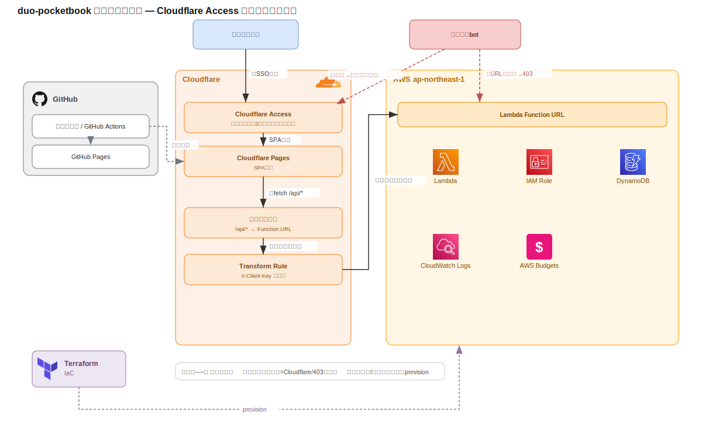

# インフラ構成図

duo-pocketbook のインフラ全体（AWS・Cloudflare・GitHub）の構成図と説明。

この構成は「アクセス制限とコスト最適化」まで含めた**推奨構成（Cloudflare Access による実行元制限）**を示す。最小構成（Cloudflare 無し・GitHub Pages から直接 Function URL）でも動作する。詳細は [デプロイガイド](./deployment.md) を参照。

## 全体像

> 上図（`infrastructure.svg`）と編集元の [`infrastructure.drawio`](./infrastructure.drawio)（[app.diagrams.net](https://app.diagrams.net) または VS Code の Draw.io Integration 拡張で開ける）は、いずれも**公式アイコン**を使用している。
> - **AWS**（Lambda / IAM / DynamoDB / CloudWatch Logs）: `.drawio` は draw.io 内蔵の公式ステンシル（aws4）、`.svg` は公式カラーアイコンを埋め込み。**AWS Budgets** は公式カラーアイコン素材が入手できなかったため、Cloud Financial Management カテゴリ色のタイルで代替（`.drawio` は aws4 の budgets ステンシル）。
> - **Terraform / GitHub / Cloudflare**: 公式ロゴを使用。
>
> **図を更新したら `.drawio` と `.svg` の両方を同期する**こと（`.drawio` を draw.io で編集し、SVG エクスポートで `.svg` を差し替えるのが確実）。

## リクエストの流れ

1. **① 認証**: 夫婦がブラウザで `app.example.com` にアクセスすると、Cloudflare Access が SSO 認証（許可メールのみ）。未認証は Cloudflare のエッジで遮断され、AWS には到達しない。
2. **SPA 配信**: 認証後、Cloudflare Pages が SPA（`frontend/dist`）を返す。
3. **② API 呼び出し**: SPA は同一オリジンの `/api/*` を `fetch`。同一オリジンのため Access の Cookie が有効。
4. **③ オリジンへ転送**: Cloudflare が `/api` を除去して Lambda Function URL へ転送。その際 Transform Rule で秘密ヘッダ `X-Client-Key` を注入する。
5. **実行**: Lambda が `X-Client-Key` を検証（不一致は403）し、JWT 認証を経て DynamoDB を読み書きする。ログは CloudWatch Logs へ。

生の Function URL を直接叩く迂回は、`X-Client-Key` が無いため 403 で弾かれる（実行元を「Cloudflare 経由」に限定）。

## リソース一覧

### Cloudflare（無料プラン＋ドメイン代のみ）

| リソース | 役割 | 備考 |
|---|---|---|
| Cloudflare Access | 夫婦2人のSSO認証。未認証をエッジで遮断 | 無料枠（50ユーザーまで）。Lambda 起動を防ぎコストを保護 |
| Cloudflare Pages | フロントエンド（SPA）配信 | ビルド環境変数 `VITE_API_BASE=/api`。無料 |
| ルーティング / Transform Rule | `/api/*` を Function URL へ転送し、秘密ヘッダ `X-Client-Key` を注入 | 秘密はブラウザに置かずサーバ側で付与 |

### AWS ap-northeast-1（すべて常時無料枠内・Terraform 管理）

| リソース | 役割 | 定義 | 無料枠・設定の意図 |
|---|---|---|---|
| Lambda Function URL | APIエンドポイント | `terraform/lambda.tf` | 追加料金なし（API Gatewayは12ヶ月無料のみのため不使用）。`auth NONE`＋`X-Client-Key`検証で実行元制限 |
| Lambda | Go/arm64 の API 本体 | `terraform/lambda.tf`, `cmd/lambda` | 128MB・timeout 5s でGB秒最小化。**予約同時実行数2**で大量アクセス時もコスト上限を固定 |
| IAM Role | Lambda の実行権限 | `terraform/lambda.tf` | 対象テーブルの GetItem/PutItem/DeleteItem/Query とログ出力のみの最小権限 |
| DynamoDB | 永続化（シングルテーブル設計） | `terraform/*.tf`, `internal/infrastructure/dynamodb` | PROVISIONED 1RCU/1WCU（オンデマンドは無料枠外のため不使用） |
| CloudWatch Logs | Lambda ログ | `terraform/lambda.tf` | 保持7日（無料枠5GB内） |
| AWS Budgets（任意） | コスト監視 | `terraform/budget.tf` | `budget_alert_email` 設定時のみ。月$1超過で通知 |

### GitHub

| リソース | 役割 | 備考 |
|---|---|---|
| リポジトリ / GitHub Actions | CI（Lint/Test/Build）・デプロイ | `.github/workflows/` |
| GitHub Pages | 公開デモ（モック）配信 | `deploy-pages.yml`。API不要のデモモード用。Cloudflare Access構成とは別に公開デモを残す場合に使用 |

## 設計の要点

- **コスト**: すべて AWS 常時無料枠内。予約同時実行数を絞り、攻撃時もコストが青天井にならないようにしている（[deployment.md](./deployment.md) の「アクセス制限とコスト最適化」参照）。
- **実行元制限**: Cloudflare Access で未認証を AWS 手前で遮断し、秘密ヘッダで生 Function URL の直叩きを封じる。
- **認証**: 環境変数の2ユーザー（bcrypt）＋ JWT。Cognito 不使用（[api.md](./api.md) 参照）。
- **依存の向き・レイヤー**: クリーンアーキテクチャの詳細は [architecture.md](./architecture.md)。

> 注: 本リポジトリのドキュメント図は原則 Mermaid（CIで構文検証）だが、本ページはインフラ図として draw.io 形式で管理し、ドキュメントには画像（SVG）を埋め込んでいる。図を更新したら編集元の `infrastructure.drawio` と、埋め込み画像 `infrastructure.svg` の両方を同期すること（draw.io の SVG エクスポート等で再生成）。
